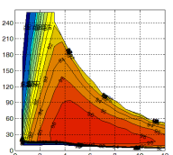

# Electric Motor (EM) efficiency map model
> This is a project for model the electric motor efficiency map based on a published scientific paper.

## Table of contents
* [General info](#general-info)
* [Screenshots](#screenshots)
* [Technologies](#technologies)
* [Setup](#setup)
* [Features](#features)
* [Status](#status)
* [Inspiration](#inspiration)
* [Contact](#contact)

## General info
* The final objective is to have a script able to deliver the efficiency value for a certain electric motor working on a specific torque and speed/rpm.
* This is necessary for a Hybrid Electric Vehicle (HEV) Reinforcement Learning optimization.
* CAVEAT_1 The regression coefficients were normalised to base values, which are 250 Nm for torque and 12 kr/mim for speed (this is the rated motor speed     used for the model).
* CAVEAT_2 The script covers the situation of motor operating under constant torque and power. The user must be sure the motor works under this regimes     indeed. Moreover, the motor speed border between the two afore mentioned working regimes must be known (e.g., (3-3.3) kr/min as upper limit of constant   torque regime).

## Screenshots

## Technologies
* Plain Python and some of its specialized lybraries

## Setup
* Keep the scripts and files in the same folder.

## Code Examples
Show examples of usage:
* Import the script as a python module import eem.py as eem.

## Features
List of features ready and TODOs for future development
* The loss function for both IPM and ISM motor types, operating under one regime (i.e., no constant torque or power regimes) are covered already in the     script.

To-do list:
* ~~Understand the EM model~~.
* ~~Efficiency is computed based on regression => we need a function to implement the regressor so efficiency could be delivered continuously across speed     and torque ranges~~.

## Status
* Project is: _in progress.

## Inspiration
https://www.researchgate.net/publication/308830029_Efficiency_maps_of_electrical_machines

## Contact
rdt333@gmail.com - feel free to contact me!
